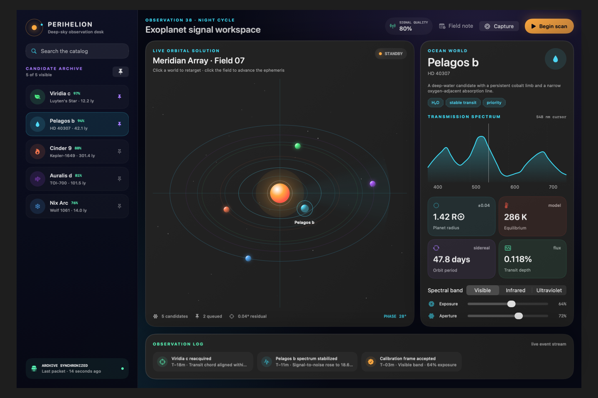

# Perihelion

Perihelion is an original, multi-file SwiftUI demo built as a real product UI:
an interactive observation desk for classifying exoplanet signals. It was
designed independently of the interpreter's current API coverage and then added
to Dynamic SwiftUI as an end-to-end project demo.



The app combines an animated orbital field, a searchable and pinnable target
catalog, Swift Charts spectral analysis, Observation-backed state, async scan
progress, instrument controls, event history, and field notes.

## Run it natively

```bash
xcrun swift run --package-path Examples/Perihelion
```

## Run the same source through Dynamic SwiftUI

```bash
xcrun swift run DynamicSwiftUIDemo -- \
  --platform macOS \
  --project Examples/Perihelion/Sources/Perihelion
```

For a headless snapshot:

```bash
xcrun swift run DynamicSwiftUIDemo -- \
  --platform macOS \
  --project Examples/Perihelion/Sources/Perihelion \
  --render-png /tmp/perihelion.png \
  --size 1320x860 \
  --appearance dark
```

## What to try

- Search by world, system, class, or atmospheric tag.
- Pin candidates and filter the archive to the observation queue.
- Select planets directly on the orbital map.
- Switch visible, infrared, and ultraviolet spectral bands.
- Tune exposure and aperture and watch the spectrum and quality model react.
- Start an asynchronous scan, capture quick readings, and advance the orbit.
- Attach a field note and see it appear in the live observation log.
