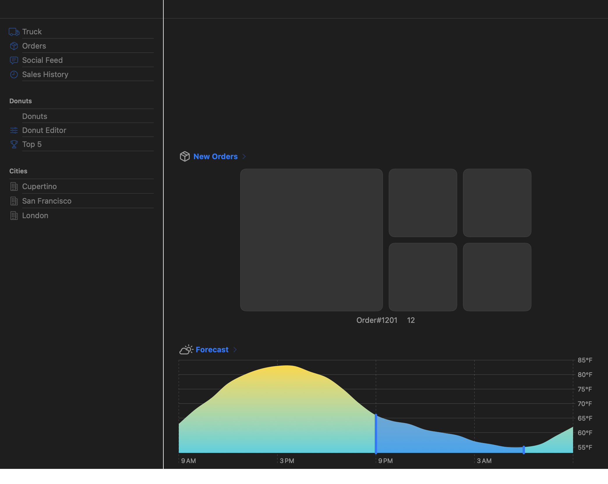

# Dynamic SwiftUI

<p align="center">
  <strong>Run Swift and SwiftUI source at runtime — from a single live-edited view to a real multi-file app.</strong>
</p>

<p align="center">
  
  
  
  
</p>

Dynamic SwiftUI is a tree-walking Swift interpreter built with
[SwiftSyntax]. It evaluates Swift source inside a running app and turns
interpreted `View` values into real SwiftUI views — with state, bindings,
observation, navigation, networking, and async work kept alive across
re-renders.

This is not a WebView, a JSON UI schema, or a reimplementation of SwiftUI.
Generated, statically compiled gateways call the platform's actual SwiftUI,
Foundation, AppKit, and UIKit APIs.



<p align="center"><em>Apple's multi-file Food Truck sample running through the interpreter on macOS, with the real SwiftUI and Charts rendering stack.</em></p>

## Why it is interesting

- **Edit and run SwiftUI without rebuilding the host.** The included demo puts
  a source editor beside a live, interactive preview.
- **Load whole projects.** Merge Swift files, discover the `@main App`
  composition root, preserve project resources, and render the app's own model
  graph rather than a hand-built fixture.
- **Use native framework behavior.** Supported SDK calls cross typed gateways
  into the frameworks already installed on the target platform.
- **Keep source semantics alive.** `@State`, `@Binding`, Observation,
  `ObservableObject`, environment values, representables, task lifecycles, and
  actor mailboxes participate in the running view tree.
- **Measure against native Swift.** The repository includes compiled twins,
  same-source differential tests, deterministic network replay, pixel boards,
  interaction boards, and a large real-project corpus.

## Quick start

You need macOS and an Xcode toolchain capable of building a Swift 6.2 package.
The current checkout is verified with Apple Swift 6.3.3 and the macOS 26.5 SDK;
the package deployment targets are macOS 15 and iOS 18.

```bash
git clone https://github.com/wowlocal/swiftui-dynamic.git
cd swiftui-dynamic
xcrun swift run DynamicSwiftUIDemo
```

The demo opens with **Atmosphere**, a live weather and air-quality app. Edit its
Swift source on the left; the interpreted SwiftUI hierarchy updates on the
right. The default demo uses live HTTP for city search and forecast data.

For a deterministic offline run, replay the checked-in Lisbon responses:

```bash
xcrun swift run DynamicSwiftUIDemo \
  --project Examples/Atmosphere \
  --network replay:Fixtures/open-meteo-lisbon
```

Or launch a larger multi-file project directly:

```bash
xcrun swift run DynamicSwiftUIDemo \
  --platform macOS \
  --project Examples/FoodTruckBuildingASwiftUIMultiplatformApp
```

You can also render a sample to a deterministic PNG without opening the editor:

```bash
xcrun swift run DynamicSwiftUIDemo \
  --sample Calculator \
  --appearance dark \
  --render-png /tmp/calculator.png
```

The built-in picker includes Atmosphere, Counter, Calculator, Tic-Tac-Toe,
Todo, Form, Weather, Layout, List, Segments, Material, Popup, and Albums.

## Embed the runtime

The package exposes two library products:

- `SwiftInterpreter` — the framework-neutral Swift execution engine.
- `SwiftUIBridge` — the native SwiftUI and Apple SDK bridge.

The high-level bridge API is deliberately small:

```swift
import SwiftUIBridge

let source = #"""
struct Greeting: View {
    @State private var count = 0

    var body: some View {
        Button("Hello \(count)") {
            count += 1
        }
        .buttonStyle(.borderedProminent)
    }
}

Greeting()
"""#

let rendered = InterpreterHost().render(source: source)
// Result<AnyView, RuntimeError>
```

For whole projects, `InterpreterHost` also accepts a target-aware
`ProjectBuildManifest`, optional compiler preflight, an explicit platform
configuration, and a project resource root.

## What runs today

Dynamic SwiftUI implements a practical, demand-driven subset of Swift rather
than a toy expression language.

| Area | Current coverage |
| --- | --- |
| Swift language | Functions and closures, structs and classes, enums with associated values, protocols and extensions, generics, optionals, collections, subscripts, key paths, control flow, error handling, property observers, result builders, Codable synthesis, and value/reference semantics across calls and storage. |
| SwiftUI | Stacks, lists, forms, grids, navigation, tabs, controls, presentations, environment propagation, shapes and paths, gradients, styles, toolbars, representables, custom `View` bodies, and hundreds of generated initializers and modifiers. |
| State and data flow | `@State`, `@Binding`, `@StateObject`, `@ObservedObject`, `@EnvironmentObject`, typed Observation environments, `@Observable`, `@Published`, bindable projections, and an in-memory query store for SwiftData/Core Data-shaped flows. |
| Concurrency | `async`/`await`, `Task`, cancellation, task groups, async let, task locals, clocks, continuations, async sequences, actor identity/mailboxes, executor hops, SwiftUI `.task`, and opt-in bounded physical execution for explicitly admitted Sendable work. |
| Apple SDKs | Generated SwiftUI, Foundation, AppKit, UIKit, Core Graphics, QuartzCore, WebKit, MapKit, Core Location, Metal, Charts, StoreKit, PhotosUI, MusicKit, Symbols, and related overlay surface. |
| Projects and I/O | Multi-file source loading, `@main App` discovery, resources, target-aware conditional compilation, URLSession live/replay modes, JSON decoding, sandboxed file operations, and located runtime diagnostics. |

Coverage is intentionally grown from real source demand. An unsupported call
is a runtime boundary to improve, not an invitation to add an app-specific
shortcut.

## Proven on real apps

The project treats native Swift as the oracle. Expectations come from code
compiled with the same Xcode toolchain, not from values copied into interpreter
tests.

| Board | Current committed result |
| --- | --- |
| Apple Food Truck | 18/18 deterministic screen captures at pixel AE 0; model mutation and live navigation boards green. |
| IceCubes | 10 of 11 scored screens at pixel AE 0; the remaining screen differs on two classified antialiasing pixels. Both committed cross-screen interaction scenarios match the compiled Catalyst twin exactly. |
| Real-project corpus | 678/680 project units pass in the full corpus; the standalone 586-unit corpus is 586/586. The two accepted full-corpus misses are explicit ledger entries, not silently skipped checks. |
| Generated API parity | 345/345 stable compiled-vs-interpreted probes match, with zero divergences and zero interpreter errors; 17 clock/locale-volatile probes are reported separately. |
| Replay networking | 5/5 deterministic live-data scenarios pass against recorded TMDB and Mastodon responses plus bundled app resources. |
| Concurrency parity | 264 manifest-owned cases and 5,128 bounded native/interpreter repetitions cover successes, diagnostics, traps, cancellation, cleanup, ownership, and physical-worker boundaries. |

The IceCubes boards go beyond first render: they run the app's own Mastodon
client and view models, paginate a timeline, push status detail, switch
destinations, and compare post-interaction output with a compiled native twin.
Live HTTP is checked separately so fixture determinism cannot hide schema drift.

## SDK coverage is generated

Hand-writing one bridge for every SDK overload does not scale. `BridgeGen`
reads the SDK's `swiftinterface` files and Clang-imported symbol graphs, maps
their type structure into reusable coercions, and emits statically compiled
gateways.

The checked-in generated surface currently includes:

- **1,063 modifier overload variants** across **388 names**;
- **731 initializer variants** across **110 SwiftUI structs**;
- **272 value-type properties** and **230 method variants**;
- **1,020 Foundation reference-type property contracts**;
- **220 contextual SDK value types** and **60 environment writers**; and
- generated platform constructors, properties, methods, globals, and
  contextual values across AppKit, UIKit, and Metal.

Every emitted call is compiled against the real framework. Incorrect signatures
therefore fail during the build, while overload selection at runtime still uses
the labels, defaults, generic constraints, effects, and coercible parameter
types parsed from the interface.

Regenerate or inspect coverage with:

```bash
xcrun swift run BridgeGen --emit
xcrun swift run BridgeGen --report-json .build/bridgegen-coverage.json
```

Ordinary API gaps must be fixed in interface analysis, type mapping, coercion,
or a reusable generated adapter. Handwritten bridge code is reserved for
framework semantics an interface cannot express, such as result-builder
execution, framework-supplied closure inputs, state identity, child identity,
and preservation of opaque `View`, `Shape`, and `ShapeStyle` values. The
binding development rule lives in [`AGENTS.md`](AGENTS.md).

## How it works

```text
Swift source files
      │
      ▼
SwiftParser + SwiftOperators
      │  parsed and precedence-folded syntax
      ▼
immutable declaration, call-site, type, and source indexes
      │
      ▼
tree-walking evaluator ───────▶ task runtime / actor mailboxes
      │
      ▼
typed HostRegistry contracts
      │
      ├──▶ BridgeGen gateways ──▶ real SwiftUI / Foundation / platform APIs
      │
      └──▶ semantic adapters for interface-inexpressible SwiftUI behavior
      │
      ▼
AnyView hosted by SwiftUI
```

The interpreter core does not import SwiftUI. It produces `RuntimeValue`s and
talks through typed host contracts. `SwiftUIBridge` owns framework-specific
behavior and wraps a source-defined `View` in `InterpretedView`; when SwiftUI
asks for `body`, the interpreter evaluates that source body. State writes
publish through the same hosted tree, causing SwiftUI to request it again.

For the deeper design, see
[`Docs/InterpreterArchitecture.md`](Docs/InterpreterArchitecture.md).

## Verification

Run the public test suite with:

```bash
xcrun swift test
```

The full development closing gate runs test shards, same-source concurrency
parity, project-corpus evaluation, generated API parity, replay networking,
anti-drift checks, and the deterministic IceCubes pixel and interaction boards:

```bash
Scripts/gate.sh
```

The closing gate expects the repository's pinned external OSS corpus and native
twin inputs; a fresh public checkout can run `swift test`, the bundled examples,
BridgeGen, and the checked-in Atmosphere replay without that external working
set. Parallelism and gate tuning are documented in
[`Docs/ParallelVerification.md`](Docs/ParallelVerification.md).

Concurrency claims are machine-owned rather than inferred from syntax support:

- [`Docs/SwiftConcurrencyArchitecture.md`](Docs/SwiftConcurrencyArchitecture.md)
  defines the target architecture and milestone boundaries.
- [`Tests/ConcurrencyParity/Manifests/milestone-acceptance.json`](Tests/ConcurrencyParity/Manifests/milestone-acceptance.json)
  is the status source of truth.
- [`Docs/ConcurrencyVerificationMethodology.md`](Docs/ConcurrencyVerificationMethodology.md)
  explains native baselines, negative controls, repetition, and receipts.
- [`Docs/ConcurrencyParity.md`](Docs/ConcurrencyParity.md) records the evidence
  behind each landed slice.

## Current boundaries

Dynamic SwiftUI is an experimental runtime, not a replacement for `swiftc` or
an App Store production dependency yet.

- The evaluator implements a growing Swift subset; it does not provide general
  compiler-grade type inference or exhaustive language coverage. Optional
  compiler preflight can fail closed against a real Apple target before a
  project runs.
- Cooperative execution is the default. Physical parallelism is opt-in and
  only admits operations that can cross the checked Sendable snapshot boundary;
  the remaining M9 surface is explicitly partial.
- Device-, account-, entitlement-, persistence-, and hardware-backed services
  use deterministic fresh-state or inert behavior unless a real host gateway is
  available. The native twin decides what parity can honestly be claimed.
- Some compiler ownership features, including general coroutine `_read` and
  `_modify` accessors, are diagnosed at the point of demand rather than
  approximated.
- Re-parsing source starts a new program generation, so live edits intentionally
  reset program state that may no longer match the edited declarations.

These constraints are deliberate and tested. Unsupported behavior should be
visible, located, and attributable — never hidden behind a fixture-specific
success path.

## Repository map

| Path | Purpose |
| --- | --- |
| [`Sources/SwiftInterpreter`](Sources/SwiftInterpreter) | Parser integration, runtime values, evaluator, sessions, concurrency, and host contracts. |
| [`Sources/SwiftUIBridge`](Sources/SwiftUIBridge) | SwiftUI semantics, native hosting, platform adapters, and generated gateways. |
| [`Sources/BridgeGen`](Sources/BridgeGen) | Interface and symbol-graph analysis plus code generation. |
| [`Sources/DynamicSwiftUIDemo`](Sources/DynamicSwiftUIDemo) | Live editor, project runner, snapshot mode, and interaction sweep. |
| [`Examples`](Examples) | Bundled interpreted apps, native twins, and focused platform demos. |
| [`Tests`](Tests) | Unit, integration, native differential, compiler-preflight, platform, and concurrency parity suites. |
| [`Scripts`](Scripts) | Closing gate, capture boards, corpus runners, and verification tooling. |

## Contributing

Start with a minimal source reproducer and a native Swift observation. Add a
focused regression test, improve the reusable runtime or generated bridge
mechanism, regenerate checked-in outputs when needed, and finish with the
relevant parity board. Do not edit files under
`Sources/SwiftUIBridge/Generated/` by hand.

Dynamic SwiftUI was inspired by [Bitrig's Swift interpreter series][bitrig-1]
and [Cocoanetics/SwiftScript][swiftscript].

[SwiftSyntax]: https://github.com/swiftlang/swift-syntax
[bitrig-1]: https://bitrig.com/blog/swift-interpreter
[swiftscript]: https://github.com/Cocoanetics/SwiftScript
